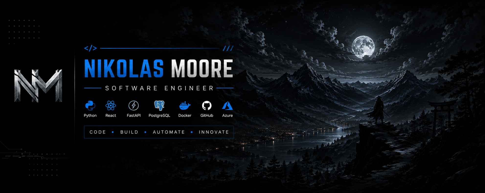

<!--
==============================================================================
Nikolas Moore | GitHub Profile README
Repository: ncmoore55/ncmoore55
==============================================================================
-->

 

# 👋 Hi, I'm Nikolas Moore

### Software Engineer | Full-Stack Developer | Microsoft Certified: Azure Fundamentals

I love solving complex problems and building software that makes people's lives easier.

 

---

## ⚡ Quick Snapshot

| | |
|---|---|
| 🎓 **Education** | B.S. in Computer Information Systems — Colorado Mesa University |
| 🏅 **Background** | Cum Laude Graduate and Former NCAA Division II Student-Athlete |
| ☁️ **Certification** | Microsoft Certified: Azure Fundamentals — AZ-900 |
| 🚗 **Flagship Project** | FleetIQ AI — Vehicle Intelligence Platform |
| 💻 **Development Focus** | Full-Stack Software Engineering |
| 🐍 **Languages** | Python, JavaScript, TypeScript, SQL |
| 🧰 **Core Stack** | React, FastAPI, PostgreSQL, Git, GitHub |
| 🎯 **Career Goal** | Software Engineering, Backend Development, and Cloud Development |

---

## 👨‍💻 About Me

I'm a software engineer with a degree in Computer Information Systems from Colorado Mesa University.

I enjoy building full-stack applications that solve real-world problems using technologies such as **Python**, **React**, **FastAPI**, **PostgreSQL**, **Git**, and **Microsoft Azure**.

Rather than only completing tutorials, I learn by building. My projects allow me to work across frontend development, backend APIs, relational databases, testing, debugging, version control, DevOps fundamentals, and cloud technologies.

My background in NCAA Division II athletics and construction taught me how to communicate with a team, accept feedback, stay accountable, and continue working through difficult problems.

---

---

## 🔥 What I'm Building

| 🚀 Focus | Description |
|---|---|
| 🚗 **FleetIQ AI** | Building a full-stack vehicle and auction intelligence platform using React, TypeScript, FastAPI, Python, and PostgreSQL. |
| 💼 **Moore Agency CRM** | Developing and improving a CRM for managing leads, customer interactions, tasks, projects, and business operations. |
| ☁️ **Cloud Development** | Applying Microsoft Azure fundamentals while learning cloud deployment and scalable application architecture. |
| 🔄 **Software Delivery** | Using Git, GitHub, GitHub Actions, testing, and development workflows to build software iteratively. |
| 📚 **Continuous Learning** | Strengthening my full-stack, backend, database, cloud, debugging, and software engineering skills through hands-on projects. |

---

# 🚀 Flagship Project

## 🚗 FleetIQ AI — Auction & Vehicle Intelligence Platform

FleetIQ AI is a full-stack application designed to help users search for and evaluate vehicles available through public auctions.

The project is being built as a hands-on software engineering experience, allowing me to understand how a modern application works from the user interface to the API, database, testing, version control, and future cloud deployment.

### Current Progress

- Created the project structure with separate frontend and backend applications
- Built the frontend using React, TypeScript, HTML, and CSS
- Created the initial vehicle search interface
- Added form fields and search criteria for auction vehicles
- Initialized a Python virtual environment for the backend
- Created and ran the FastAPI development server
- Connected the project to Git and GitHub
- Documented progress through frequent, focused commits

### Planned Features

- Vehicle search by make, model, year, mileage, and price
- FastAPI REST API endpoints
- PostgreSQL database integration
- Auction listing storage and retrieval
- Search filtering and sorting
- Vehicle detail pages
- User authentication
- AI-assisted vehicle insights
- Docker containerization
- Automated testing and CI/CD
- Microsoft Azure deployment

### Technology Stack

#### Frontend

`React` `TypeScript` `JavaScript` `HTML5` `CSS3` `Vite`

#### Backend

`Python` `FastAPI` `REST APIs`

#### Database

`PostgreSQL`

#### Development & DevOps

`Git` `GitHub` `GitHub Actions` `Docker` `VS Code`

#### Cloud

`Microsoft Azure`

---

## 💼 Featured Projects

<table>
<tr>
<td width="50%" valign="top">

### 🚗 FleetIQ AI

A full-stack vehicle and auction intelligence platform currently under development.

**Highlights**

- React and TypeScript frontend
- FastAPI Python backend
- Vehicle search interface
- REST API architecture
- PostgreSQL database planned
- Git and GitHub workflow
- Cloud deployment planned

**Tech**

`React` `TypeScript` `FastAPI` `Python` `PostgreSQL` `Git`

</td>

<td width="50%" valign="top">

### 💼 Moore Agency CRM

A customer relationship management application built to manage leads, interactions, tasks, projects, and business workflows.

**Highlights**

- 50+ sample customer records
- Relational database structure
- Lead and customer tracking
- Interaction history
- Follow-up task management
- Project tracking
- GitHub Actions testing
- Ubuntu VM deployment practice

**Tech**

`Python` `Streamlit` `MySQL` `SQL` `Git` `GitHub Actions`

</td>
</tr>

<tr>
<td width="50%" valign="top">

### 🏗️ JustinFloors Operations Dashboard

A business operations dashboard designed for a flooring contractor to replace spreadsheet-based job tracking.

**Highlights**

- Customer management
- Job tracking
- Material tracking
- Installation scheduling
- Invoice visibility
- Relational database design
- Business workflow improvement

**Tech**

`Python` `Streamlit` `MySQL` `SQL`

</td>

<td width="50%" valign="top">

### 🌐 Nik's Web Design

A collection of responsive websites built for small-business demonstrations and client outreach.

**Highlights**

- Three small-business website demonstrations
- Responsive layouts
- User interface improvements
- GitHub version control
- Vercel deployment
- Client-focused design workflow

**Tech**

`HTML` `CSS` `JavaScript` `GitHub` `Vercel`

</td>
</tr>

<tr>
<td width="50%" valign="top">

### 📈 Goal & Discipline Tracker

A productivity application used to track daily goals, habits, progress, and consistency.

**Highlights**

- Daily goal tracking
- Habit completion
- Progress monitoring
- Mobile-friendly use
- Testing and debugging
- Docker and GitHub workflow practice

**Tech**

`Python` `Docker` `Git` `GitHub Actions`

</td>

<td width="50%" valign="top">

### 🔐 Cybersecurity Labs

Hands-on security labs completed through coursework and the Google Cybersecurity Professional Certificate.

**Highlights**

- Linux command-line work
- Network traffic analysis
- Vulnerability scanning
- SIEM and IDS fundamentals
- Digital forensics tools
- Security documentation

**Tools**

`Linux` `Wireshark` `Wazuh` `Suricata` `Nmap` `Autopsy`

</td>
</tr>
</table>

---

## 🧰 Tech Stack

### Programming Languages

### Frontend Development

### Backend Development

### Databases

### Cloud & DevOps

### Development Tools

### AI-Assisted Development

---

## 📚 Currently Learning

| Skill | Current Focus |
|---|---|
| ⚛️ **React & TypeScript** | Component structure, state, forms, interfaces, and frontend architecture |
| 🚀 **FastAPI** | Routes, request handling, response models, validation, and REST APIs |
| 🗄️ **PostgreSQL** | Relational design, queries, application connections, and data management |
| ☁️ **Microsoft Azure** | Applying AZ-900 knowledge through application hosting and cloud deployment |
| 🐳 **Docker** | Containers, images, Dockerfiles, and development environments |
| 🔄 **CI/CD** | GitHub Actions, automated testing, and deployment workflows |
| 🏗️ **Software Architecture** | Separating frontend, backend, database, and cloud responsibilities |
| 🧪 **Testing & Debugging** | Finding issues, validating behavior, and improving application reliability |

---

## 🏆 Highlights

- 🎓 B.S. in Computer Information Systems
- 🏅 Graduated Cum Laude
- ☁️ Microsoft Certified: Azure Fundamentals — AZ-900
- 🛡️ Google Cybersecurity Professional Certificate
- 🥍 Former NCAA Division II Student-Athlete and Assistant Captain
- 🚗 Building FleetIQ AI with React, FastAPI, and PostgreSQL
- 💼 Built a CRM with 50+ sample customer records
- 🗄️ Designed relational databases using primary and foreign keys
- 🔄 Built GitHub Actions testing workflows
- 🐧 Deployed and tested software using an Ubuntu virtual machine
- 🌐 Built and deployed responsive websites using GitHub and Vercel

---

## 📊 GitHub Analytics

---

## 🐍 Contribution Snake

---

## 💡 My Mindset

### “Build. Learn. Improve. Repeat.”

I believe the best way to become a stronger software engineer is to build real software, understand how it works, learn from mistakes, and improve one step at a time.

---

## 📫 Let's Connect

---

  

Built with curiosity, discipline, problem-solving, and a lot of debugging.

 

Always learning. Always building. Always shipping.

